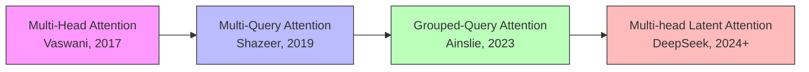
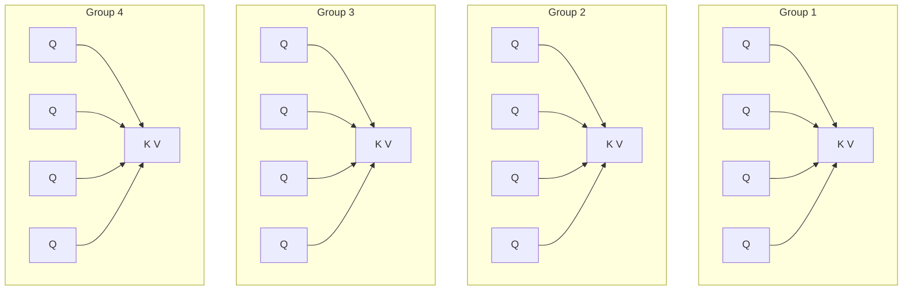

# Awesome-Group-Query-Attention

## Grouped-Query Attention: History, Progression, Variants, & Applications

**Grouped-Query Attention (GQA)** represents a foundational paradigm shift in the structural design and inference scaling of autoregressive Large Language Models (LLMs). Formally introduced by Ainslie et al. (Google Research) in May 2023 ("GQA: Training Generalized Multi-Query Transformer Models from Multi-Head Checkpoints"), GQA established an optimal architectural compromise between multi-head attention and multi-query attention. 

Prior to GQA, LLM serving architecture faced a brutal trade-off: deploy Multi-Head Attention (MHA) for maximum conversational accuracy at the cost of crippling memory bottlenecks, or use Multi-Query Attention (MQA) to slash memory overhead while severely degrading text quality. GQA inverted this compromise, proving that grouping queries together to share a **bounded number of Key-Value (KV) heads** can deliver near-MHA quality alongside near-MQA speed, establishing an ideal balance for modern hardware accelerators.

---

## 1. The Macro Chronological Evolution

The implementation of sequence model attention mechanisms has transitioned from memory-heavy individual projection states to aggressively pooled configurations, shifting toward modern variable-ratio clustering and dynamic page-allocated streaming frameworks.

*   **The Unbounded Projection Era (Multi-Head Attention / MHA, 2017)**
    *   *Concept:* The foundational attention mapping standard. Every individual Query head ($Q$) possesses its own distinct Key ($K$) and Value ($V$) head mapping projection space.
    *   *Limitation:* Caused severe hardware memory capacity exhaustion during model serving. As sequence lengths scale out, storing the distinct Key-Value histories (KV Cache) for every single head consumes vast blocks of GPU VRAM, capping inference concurrency metrics.
*   **The Aggressive Pooling Crash (Multi-Query Attention / MQA, 2019)**
    *   *Concept:* Drastically flattened the memory footprint. MQA collapsed the architectural projection layer down to a singular, solitary Key and Value head shared by all Query heads simultaneously.
    *   *Limitation:* Created structural information capacity bottlenecks. Forcing dozens of complex, distinct Query expressions to route through a single KV channel degraded target model capacity, rendering large foundation architectures unstable or prone to semantic degradation.
*   **The Balanced Clustering Integration (Grouped-Query Attention / GQA, 2023)**
    *   *Concept:* Engineered a flexible midway architecture. GQA organizes Query heads into discrete, isolated groups where each separate partition shares a single local Key-Value head allocation block.
    *   *Significance:* Delivered massive hardware deployment performance leaps. GQA allows models like Llama 3 to retain the expressive contextual indexing traits of MHA while scaling out real-world generation speeds to match MQA frameworks.

---

## 2. Core Functional & Custom Configurations

Modern Transformer attention layers are structurally parameterized around the absolute proportion of total Query head groups mapped across underlying physical memory layouts.

*   Mathematical Key-to-Query Mapping Ratios
    *   **Mechanism:** Let $H_Q$ represent total Query heads and $H_{KV}$ represent Key-Value heads. The configuration controls the spatial compression layout:
        $$G = \frac{H_Q}{H_{KV}}$$
        *   When $H_{KV} = H_Q$ ($G=1$), the layout behaves identically to standard **Multi-Head Attention**.
        *   When $H_{KV} = 1$ ($G=H_Q$), the layout contracts into basic **Multi-Query Attention**.
        *   When $1 < H_{KV} < H_Q$, the system operates as **Grouped-Query Attention**, typically setting $G = 8$ for optimal balance.

*   Uptraining From Baseline MHA Checkpoints
    *   **Mechanism:** Converts an existing pre-trained MHA model into a GQA framework without needing a full pre-training run. It takes the $H_Q$ to $H_{KV}$ individual MHA keys, applies a spatial **Mean Pooling** dimension reduction across the distinct head matrices within each designated group, and runs a brief token fine-tuning phase to recalibrate projection weights.

---

## 3. High-Capacity Architectural & Scaling Classes

Depending on token length requirements or extreme throughput objectives, attention pooling utilizes specialized mathematical modifications.

*   **Dynamic Matrix Grouping (Variable Multi-Group Topology)**
    *   *The Shift:* Rather than freezing fixed head groups across every single layer block uniformly, variable topologies deploy broad MHA structures across early processing layers to capture fine-grained pixel or text roots, while switching to hyper-compressed GQA grouping setups deep inside internal hidden blocks.
*   **Low-Rank Compressional Mapping (Multi-head Latent Attention / MLA)**
    *   *The Shift:* Decouples attention mechanics further by compressing the KV Cache into a tiny, low-rank latent vector space. Instead of grouping separate heads explicitly, MLA mathematically compresses keys and values into a shared vector, expanding them back out instantly during execution to skip physical VRAM scaling walls entirely.

---

## 4. Production Engineering Challenges & Hardware Solutions

Deploying dense GQA frameworks across enterprise inferencing infrastructure introduces compilation quirks and memory alignment considerations.

*   **The Non-Uniform Tensor Layout Compilation Penalty**
    *   *The Problem:* Traditional tensor layout kernels are heavily optimized for balanced, perfectly symmetric matrix computations. If the group configuration $G$ does not cleanly align with the physical hardware thread configurations or SIMD width of the target GPU, memory bandwidth efficiency plummets.
    *   *Mitigation:* Implementing specialized **FlashAttention** kernels explicitly compiled for GQA architectures. These custom setups bypass intermediate GPU global memory reads by executing the grouped head matrix operations entirely inside local SRAM registers.
*   **The KV Cache Memory Striding Mismatch**
    *   *The Problem:* During long-context batch serving, pointer layouts for pooled KV channels can break typical linear memory reading operations, causing latency spikes when fetching token records from scattered memory blocks.
    *   *Mitigation:* Pairing GQA directly with **PagedAttention** architectures. PagedAttention fragments the grouped KV cache into structured, uniform virtual memory pages, ensuring clean hardware execution paths regardless of head counts.

---

## 5. Frontier Real-World AI Infrastructure Applications

*   **High-Concurrency Enterprise LLM Serving (vLLM / TensorRT-LLM)**
    *   *Application:* Maximizes simultaneous user request throughput. Transitioning open architectures to GQA configurations allows cloud hosting platforms to multiply batch capacities per GPU card without encountering out-of-memory errors.
*   **Massive Long-Context Sequence Parsing (Gemini / Llama 3 Ultra-Long)**
    *   *Application:* Unlocks massive text processing horizons (up to 128K+ tokens). GQA prevents the model's tracking cache from inflating exponentially, allowing systems to ingest complete document libraries or codebases in a single prompt.
*   **Edge-Device On-Chip Deep Learning Executions (Apple Silicon / Snapdragon)**
    *   *Application:* Minimizes processing overhead on localized consumer devices. Compressing model attention structures via GQA lowers memory footprints enough to serve interactive assistants directly on local mobile hardware and laptops.

---

## References
1. Vaswani, A., et al. (2017). Attention is all you need. *Advances in Neural Information Processing Systems (NeurIPS)*.
2. Shazeer, N. (2019). Fast transformer decoding: One write-head is all you need. *arXiv preprint arXiv:1911.02150*.
3. Ainslie, J., et al. (2023). GQA: Training generalized multi-query transformer models from multi-head checkpoints. *arXiv preprint arXiv:2305.13245*.

---

To advance this documentation repository, scaling architecture, or MLOps automation pipeline, consider exploring these adjacent development pathways:

* Build a **Python script using PyTorch** demonstrating how to expand a grouped GQA Key-Value tensor up to a matching Query tensor shape using the `torch.repeat_interleave` function.
* Generate a **comprehensive Markdown table** explicitly comparing Multi-Head Attention (MHA), Multi-Query Attention (MQA), Grouped-Query Attention (GQA), and Multi-head Latent Attention (MLA) across VRAM cache scaling rates, training stability metrics, and serving latencies.

***

