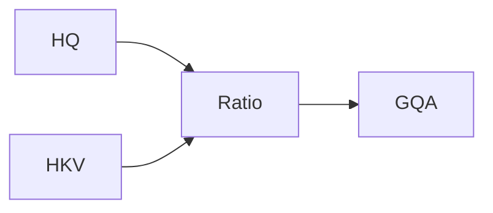

# Mathematical Key-to-Query Mapping Ratios

## Overview
Detailed information about Mathematical Key-to-Query Mapping Ratios in the context of Grouped-Query Attention.

## Diagram

[Back to README](../README.md)