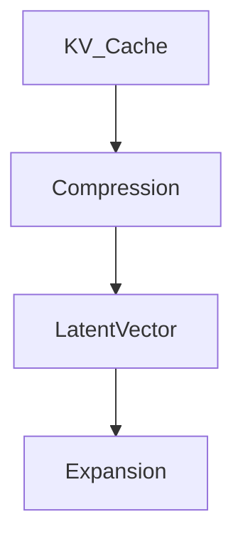

# Multi-head Latent Attention

## Overview
Detailed information about Multi-head Latent Attention in the context of Grouped-Query Attention.

## Diagram

```mermaid
graph TD; KV_Cache-->Compression; Compression-->LatentVector; LatentVector-->Expansion;
```

[Back to README](../README.md)