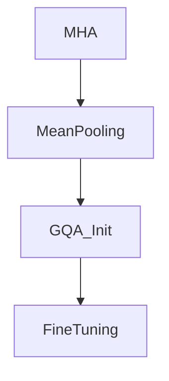

# Uptraining From Baseline MHA Checkpoints

## Overview
Detailed information about Uptraining From Baseline MHA Checkpoints in the context of Grouped-Query Attention.

## Diagram

[Back to README](../README.md)